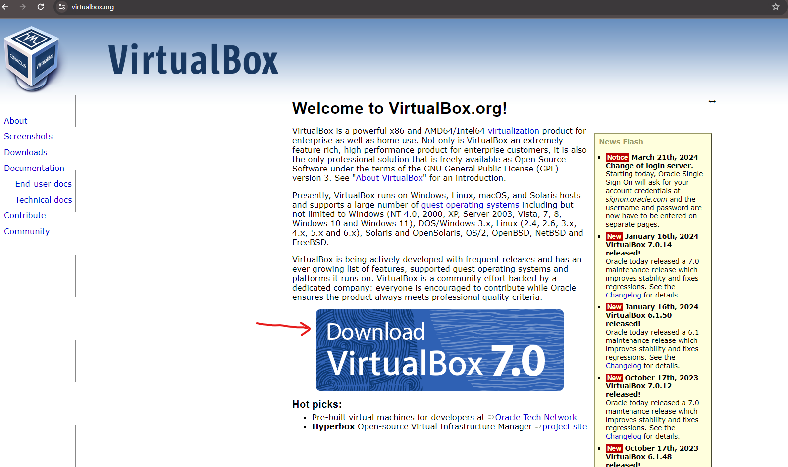
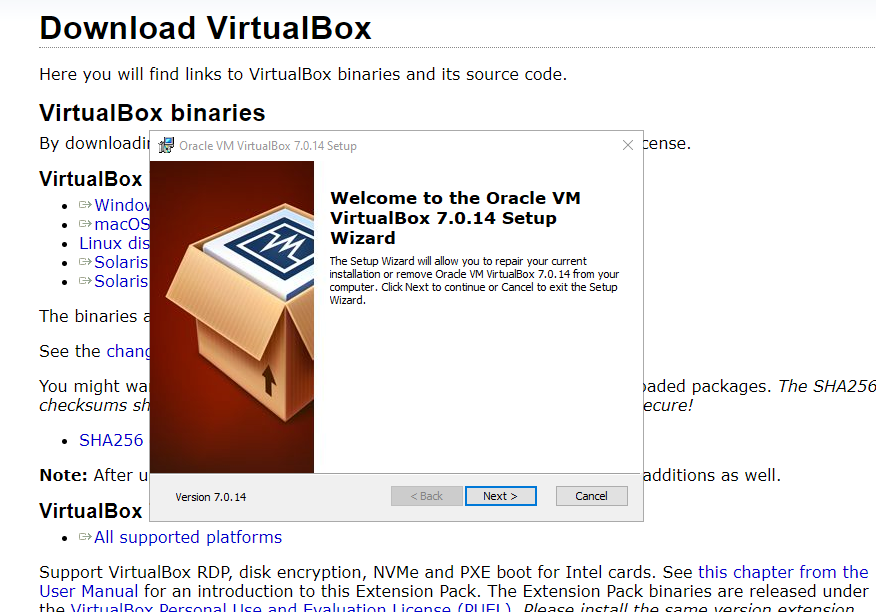

 <h1>Installing Kali Linux to Windows Using Virtual Box</h1>


<h2>Description</h2>
In this example, we will installing The Kali Linux Distro onto our Windows computer using Oracle VM Virtual Box
These are three main steps to get up an running. 


We will be using Nessus Essentials to scan local VMs hosted on VMWare Workstation in order run credentialed scans to discover vulnerabilities, remediate some of the vulnerabilities, then perform a rescan to verify remediation.
<br />


<h2>Utilities Used</h2>

- <b>Oracle VM Virtual Box</b> 

<h2>Environments Used </h2>

- <b>Kali Linux</b> (2024.1-amd64)
- 

<h2>Install Oracle VM VirtualBox to your system:</h2>
Navigate to the Oracle VM VirtualBox Webpage:

<br />
<br />
Download the appropriate VirtualBox depending on what system is in use. (In this example we are using Windows):

<br />
<br />
Follow the standard install process. 
Allow Warning: Network Interfaces prompt (This allows the VM to talk to other VMs and access the internet)
Install the missing dependencies with the program. 

<br />
<br />
Start the VitrualBox

<h2>Install Kali Linux:</h2>

<h2>Lessons Learned</h2>

- <b>The loop process of scanning and remediating to manage vulnerabilities</b>
- <b>A credential scan is will give us more feedback and alerts for us to dig into and remediate</b> 
<br />

<h2>Useful Links</h2>
- https://www.virtualbox.org/


<!--
 ```diff
- text in red
+ text in green
! text in orange
# text in gray
@@ text in purple (and bold)@@
```
--!>


