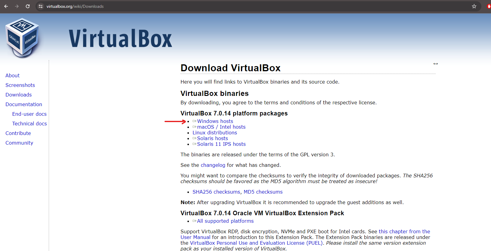
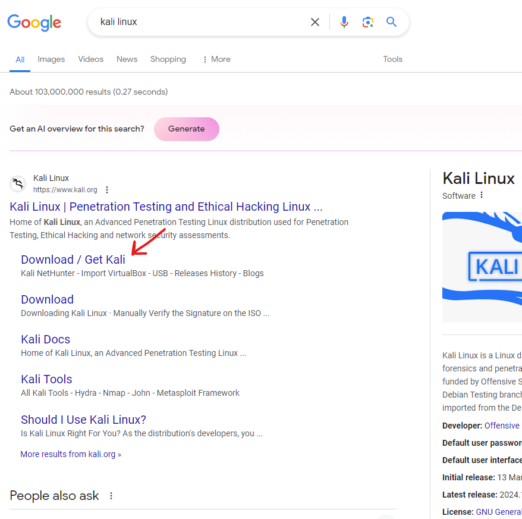
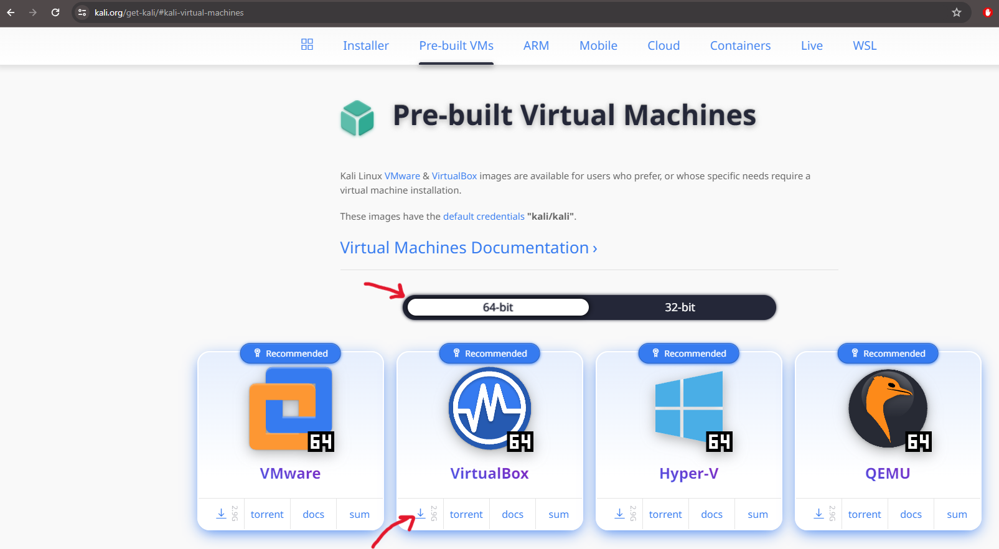

 <h1>Installing Kali Linux to Windows Using Virtual Box</h1>


<h2>Description</h2>
In this example, we will installing The Kali Linux Distro onto our Windows computer using Oracle VM Virtual Box
These are three main steps to get up an running. 


We will be using Nessus Essentials to scan local VMs hosted on VMWare Workstation in order run credentialed scans to discover vulnerabilities, remediate some of the vulnerabilities, then perform a rescan to verify remediation.
<br />


<h2>Utilities Used</h2>

- <b>Oracle VM Virtual Box</b> 

<h2>Environments Used </h2>

- <b>Kali Linux</b> (2024.1-amd64)
- 

<h2>Install Oracle VM VirtualBox to your system:</h2>
Navigate to the Oracle VM VirtualBox Webpage:

<br />
<br />
Download the appropriate VirtualBox depending on what system is in use. (In this example we are using Windows):

<br />
<br />
Follow the standard install process. <br />
Allow Warning: Network Interfaces prompt (This allows the VM to talk to other VMs and access the internet)<br />
Install the missing dependencies with the program. 

<br />
<br />
<b>Start the VitrualBox </b> 
<br />
<br />

<h2>Install Kali Linux:</h2>
Head back to the browser and search for Kali Linux and select the Download / Get Kali option under the Kali Linux page result:

<br />
<br />
Select on the Virtual Machines pre-built images from the recommended options provided. 
When in the Pre-built Virtual Machines selection, make sure that the 64-bit option is selected and download the virtual box selection.

<br />
<br />
Extract the Kali Linux zip folder to your specified location. 
<br />
<br />

<h2>Import Kali Linux into your Virtual Machine:</h2>
Back in Oracle VM Virtual Machine, select the add button on the upper side of the app and locate the contents of the extracted Kali Linux zip folder.


<br />
<br />
The machine should show up on the left of the Oracle VM app. Before we start it up there are a few settings to check and configure. 
(In the example photo there is we already have a existing VM labeled VM1 but we are going to focus on the New Kali Linux VM)

<br />
<br />
Under the advance tab under General Settings, we want to make sure that Bi-directional is enabled for both Shared Clipboard and Drag'n'Drop. (Keep in mind that this allows us to copy and paste between your virtual machine and your host machine)

<br />
<br />
In System Settings 
Under Motherboard Tab, we can configure how much RAM VirtualBox can give the machine. The Base Memory slide shows how much ram is availble. Kali Linux Distrobution is not resource intensive so 2 Gigabytes of RAM would be enough.

<br />
<br />
In Display Setting
Under the Screen tab, make sure Enable 3D Acceleration is un-checked.

<br />
<br />
In Network Settings
The tabs show 4 different adapters. We only need one adapter for this example so adapter 2, 3, and 4 can be disabled.
Adapter 1 should be enabled and attached to NAT (This allow our Kali Linux system to connect to the internet)

<br />
<br />
In Shared Folders Settings (Optional)
Select add share button and choose the folder path from host machine.
Name the Folder name and specify the mount point. This specify where our shared folder is on our Kali Linux Machine. The mount point follows a typical directory structure common to Linux distributions when specifying the path.
Ensure that read only is unchecked 
This allows us to transfer files between your host machine and and Virtual Machine. 

<br />
<br />

<b>From here we can start up the machine.<b/>


<h2>Lessons Learned</h2>

- <b>The loop process of scanning and remediating to manage vulnerabilities</b>


<!--
 ```diff
- text in red
+ text in green
! text in orange
# text in gray
@@ text in purple (and bold)@@
```
--!>


